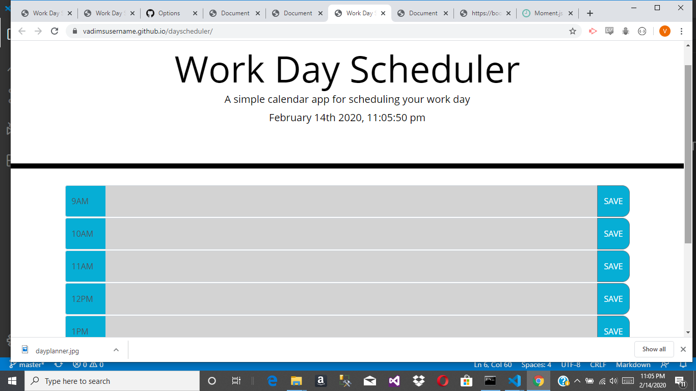

# dayscheduler
For this assignment we had to make a work day scheduler. There has to be a row for each hour from 9am to 5pm. The rows are color coded depending on wether that row's hour is before the current hour , equal to the current hour or in the future. The text that is entered in each row is saved to local storage when the save button for that row is clicked. The momentjs library is used to get the current day and time to help color code the rows and to diplay on the page. The day and time display updates every second to show the current time, and to update the color coding when the hour changes.

[Work Day Scheduler](https://vadimsusername.github.io/dayscheduler/)

[Portfolio](https://vadimsusername.github.io/portfolio.html)

